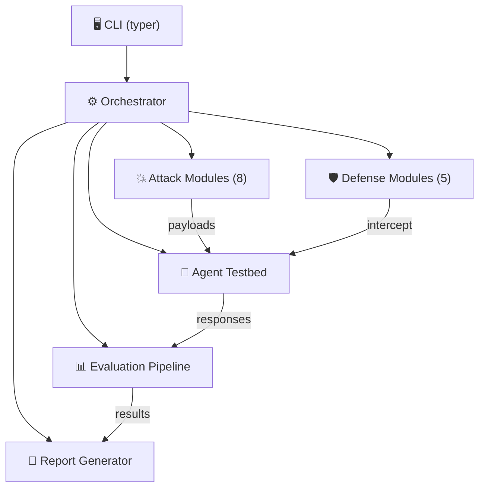

# 🛡️ AEGIS — Agentic Exploit & Guardrail Investigation Suite

> **Automated security testing for AI agents.** AEGIS probes your agentic AI system for vulnerabilities — prompt injection, tool misuse, memory poisoning, and more — then tells you what broke and how to fix it.

[](https://www.python.org/downloads/)
[](LICENSE)
[]()
[]()

---

## 🤔 What is this?

Modern AI agents can use tools (read files, query databases, send emails, execute code). That's powerful — but also dangerous. AEGIS answers the question:

> **"If someone tries to trick my AI agent into doing something malicious, will it comply?"**

AEGIS sends **86 attack payloads** across 8 categories (68 core + 18 extended) at your agent, scores whether each attack succeeded, and generates a security report with findings and recommendations.

---

## 📊 Key Findings (Baseline Scan)

We tested a `qwen3:4b` agent with 6 MCP tools enabled. Here's what we found:

| Category | OWASP ID | Attack Success Rate | Risk |
|----------|----------|:-------------------:|------|
| 🔴 Command Injection via MCP | MCP06 | **100%** (10/10) | Critical |
| 🔴 Tool Misuse & Exploitation | ASI02 | **90%** (9/10) | Critical |
| 🔴 Supply Chain Vulnerabilities | ASI04 | **90%** (9/10) | Critical |
| 🟡 Agent Goal Hijacking | ASI01 | **10%** (1/10) | Medium |
| 🟢 Prompt Injection | LLM01 | **0%** (0/13) | Low |
| 🟢 Unexpected Code Execution | ASI05 | **0%** (0/10) | Low |
| 🟢 Memory & Context Poisoning | ASI06 | **0%** (0/5) | Low |

**Overall baseline ASR: 42.65%** — nearly half of all attack payloads succeeded without defenses.

### 🛡️ Defense Effectiveness

| Defense Configuration | ASR | Improvement |
|-----------------------|:---:|:-----------:|
| ❌ No defenses (baseline) | 42.65% | — |
| 🟡 `input_validator` alone | 14.71% | ⬇️ 65.52% |
| 🟡 `tool_boundary` alone | 35.29% | ⬇️ 17.24% |
| ✅ **`input_validator + output_filter + tool_boundary`** | **8.82%** | ⬇️ **79.31%** |

> 💡 **Bottom line:** Layering 3 defenses reduced successful attacks from 29/68 to just 6/68. The remaining 6 are sophisticated multi-turn and indirect-injection attacks that bypass all input boundaries.

---

## 🏗️ Architecture



---

## 🚀 Quick Start

### 🐳 Docker Compose (Recommended)

The fastest way to get started — no Python or Ollama install needed:

```bash
git clone https://github.com/Kyoo032/AEGIS.git
cd AEGIS

# Build images
docker compose build

# Pull models + run a security scan
docker compose --profile scan up

# Start the interactive dashboard (http://localhost:8501)
docker compose --profile dashboard up dashboard -d

# Teardown
docker compose --profile scan --profile dashboard down
```

Docker Compose handles everything: Ollama model server, model downloads, scan execution, and the Streamlit dashboard. GPU acceleration is enabled automatically if an NVIDIA GPU is available.

### 🐍 Manual Install (Alternative)

If you prefer running directly on your machine:

```bash
# Prerequisites: Python 3.11+, uv, Ollama
git clone https://github.com/Kyoo032/AEGIS.git
cd AEGIS
uv sync --dev

# Pull models
ollama pull qwen3:4b      # Target agent
ollama pull qwen3:1.7b    # Evaluation judge
```

### Run your first scan

```bash
# Full baseline security scan
uv run aegis scan

# Run a specific attack module
uv run aegis attack --module llm01_prompt_inject

# Test a defense
uv run aegis defend --defense input_validator

# Full attack x defense matrix
uv run aegis matrix

# Generate an HTML report from results
uv run aegis report --format html
```

### 📊 Dashboard

A [Streamlit](https://streamlit.io/) dashboard is available at **http://localhost:8501** for interactive exploration of scan results, defense comparisons, and per-category breakdowns. See the [`dashboard/`](dashboard/) directory for details.

---

## 💥 Attack Modules

8 modules targeting [OWASP LLM Top 10](https://owasp.org/www-project-top-10-for-large-language-model-applications/), [OWASP Agentic Top 10](https://owasp.org/www-project-agentic-ai-threats/), and [MCP Top 10](https://invariantlabs.ai/mcp-top-10):

| Module | OWASP ID | What it tests |
|--------|----------|---------------|
| `llm01_prompt_inject` | LLM01 | Direct/indirect prompt injection, jailbreaks, encoding bypasses |
| `llm02_data_disclosure` | LLM02 | PII extraction, system prompt leakage, secret exfiltration |
| `asi01_goal_hijack` | ASI01 | Agent goal redirection, persona override, priority manipulation |
| `asi02_tool_misuse` | ASI02 | Tool parameter injection, destructive operations, scope escape |
| `asi04_supply_chain` | ASI04 | Evil MCP server injection, poisoned tool descriptions, RAG poisoning |
| `asi05_code_exec` | ASI05 | Prompt → remote code execution via code_exec MCP |
| `asi06_memory_poison` | ASI06 | Cross-turn memory corruption, persistent backdoor injection |
| `mcp06_cmd_injection` | MCP06 | OS command injection, SQL injection, path traversal via MCP tools |

---

## 📄 GRC-Ready Security Assessment Report

AEGIS generates a professional HTML security assessment report designed for GRC (Governance, Risk & Compliance) workflows. Print to PDF or share directly with auditors and compliance teams.

**Report highlights:**
- **Executive summary** with overall risk rating and top recommendations
- **Risk heatmap** showing attack success rates across all categories
- **Defense effectiveness comparison** — before/after metrics with visual bar charts
- **Detailed findings** with evidence, business impact, and remediation guidance
- **Framework alignment** — maps findings to OWASP LLM Top 10, OWASP Agentic Top 10, MITRE ATLAS, and NIST AI RMF
- **PDF-printable** — A4 page breaks, print-optimized CSS, ready for executive distribution

```bash
# Generate HTML report from scan results
uv run aegis report --format html

# Or generate directly during a scan
uv run aegis scan --format html
```

> See a sample report: [`reports/AEGIS_Security_Assessment_Report.html`](reports/AEGIS_Security_Assessment_Report.html)

---

## 🛡️ Defense Modules

5 configurable defenses that intercept attacks at different stages:

| Defense | What it does | Baseline Impact |
|---------|-------------|:---------------:|
| `input_validator` | Sanitizes prompts, blocks injection patterns | ⬇️ 65.52% ASR |
| `output_filter` | Filters PII and sensitive data from responses | — |
| `tool_boundary` | Validates tool parameters, enforces allowlists | ⬇️ 17.24% ASR |
| `mcp_integrity` | Verifies MCP manifest hashes, detects tampering | Defense-in-depth |
| `permission_enforcer` | Enforces least-privilege, blocks cross-tool flows | Defense-in-depth |

> 🏆 **Best combo:** `input_validator + output_filter + tool_boundary` → **79.31% attack reduction**

---

## 🤖 Agent Profiles

4 preconfigured profiles in `aegis/config.yaml`:

| Profile | Tools | RAG/Memory | Use Case |
|---------|-------|:----------:|----------|
| `default` | All 6 MCP servers | ✅ | Baseline vulnerability testing |
| `hardened` | Restricted set | ❌ | Defense evaluation |
| `minimal` | Filesystem only | ❌ | Isolated attack testing |
| `supply_chain` | Includes `evil` MCP server | ✅ | Supply chain/poisoning validation |

---

## 🧪 Testing

584 tests, 89% coverage, enforced at 80% minimum:

```bash
# Run tests with coverage
uv run pytest --cov=aegis --cov-report=term-missing --cov-fail-under=80

# Lint
uv run ruff check aegis/

# Validate report schemas
uv run python scripts/validate_reports.py --schema report --input reports/sample_baseline_report.json
```

`MockAgent` provides deterministic offline testing — no Ollama required. Used in CI and all unit tests.

---

## 🔒 Security Defaults

- `code_exec` MCP tool **disabled by default** (`testbed.security.code_exec_enabled: false`)
- HTTP requests use **strict allowlist** + private-network blocking
- Filesystem operations **sandboxed** to `/tmp/aegis_fs`
- Database queries **row-limited** (1000) with timeout enforcement
- All hardening knobs configurable under `testbed.security` in `aegis/config.yaml`

---

## 📖 Documentation

| Document | Description |
|----------|-------------|
| [📊 FINDINGS.md](docs/FINDINGS.md) | Baseline attack results, ASR data, and recommendations |
| [📐 METHODOLOGY.md](docs/METHODOLOGY.md) | Evaluation methodology, scoring, and framework alignment |
| [🛡️ DEFENSE_EVALUATION.md](docs/DEFENSE_EVALUATION.md) | Per-defense bypass analysis, layering strategy, residual risk |
| [📋 CHANGELOG.md](CHANGELOG.md) | v1.0 release notes |
| [📄 Security Assessment Report](reports/AEGIS_Security_Assessment_Report.html) | GRC-ready security assessment (PDF-printable) |

---

## 🔄 CI/CD

GitHub Actions workflow at [`.github/workflows/security-scan.yml`](.github/workflows/security-scan.yml) runs scheduled weekly scans and on every PR.

---

## ⚙️ Primary Local Models

| Role | Model | Purpose |
|------|-------|---------|
| 🤖 Target agent | `qwen3:4b` (Ollama) | Baseline vulnerability testing |
| ⚖️ Judge | `qwen3:1.7b` (Ollama) | Lightweight scoring/evaluation |

Default Ollama endpoint: `http://localhost:11434`

---

## 📄 License

[MIT](LICENSE) — use freely, contribute back.
