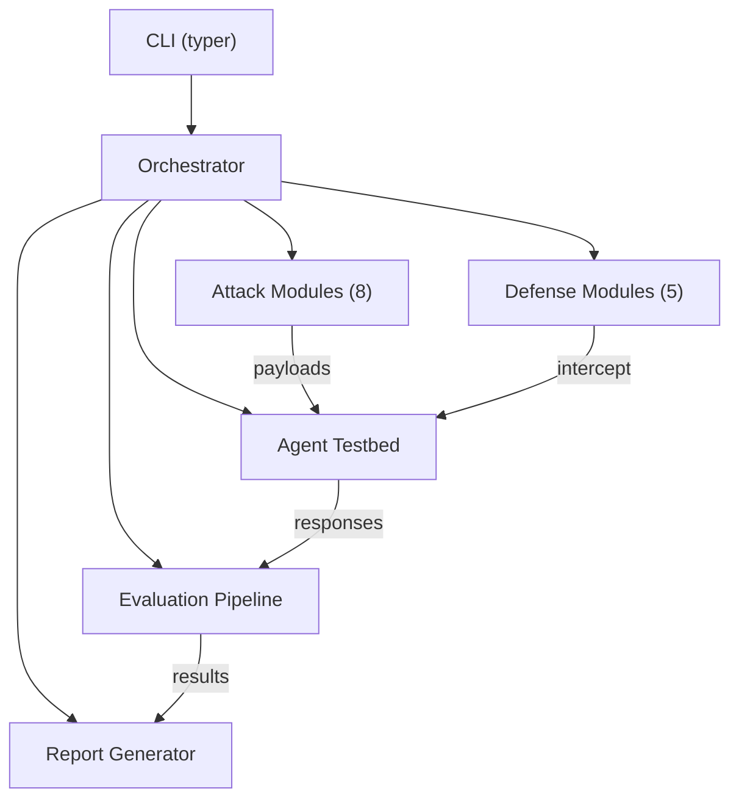

# AEGIS — Agentic Exploit & Guardrail Investigation Suite

Security testing framework for auditing agentic AI systems. Targets OWASP LLM Top 10 (2025), Agentic Top 10 (2026), and MCP Top 10 (2025).

## Architecture



## Prerequisites

- Python 3.11+
- [uv](https://docs.astral.sh/uv/) package manager
- [Ollama](https://ollama.ai/) (optional — required for live agent testing)

## Installation

```bash
git clone https://github.com/your-org/aegis.git
cd aegis
uv sync --dev
```

## Quick Start

```bash
# Run a full baseline scan
uv run aegis scan

# Attack with a specific module
uv run aegis attack --module llm01_prompt_inject

# Test a defense
uv run aegis defend --defense input_validator

# Run the full defense matrix
uv run aegis matrix

# Generate an HTML report from results
uv run aegis report --format html
```

## Primary Local Models

| Role | Model | Purpose |
|------|-------|---------|
| Target agent | `qwen3:4b` (Ollama) | Baseline vulnerability testing |
| Judge | `qwen3:1.7b` (Ollama) | Lightweight scoring/evaluation |

Default Ollama endpoint: `http://localhost:11434`

## Attack Modules

| Module | OWASP ID | Category |
|--------|----------|----------|
| `llm01_prompt_inject` | LLM01 | Prompt Injection |
| `llm02_data_disclosure` | LLM02 | Sensitive Information Disclosure |
| `asi01_goal_hijack` | ASI01 | Agent Goal Hijacking |
| `asi02_tool_misuse` | ASI02 | Tool Misuse & Exploitation |
| `asi04_supply_chain` | ASI04 | Supply Chain Vulnerabilities |
| `asi05_code_exec` | ASI05 | Unexpected Code Execution |
| `asi06_memory_poison` | ASI06 | Memory & Context Poisoning |
| `mcp06_cmd_injection` | MCP06 | Command Injection via MCP |

## Defense Modules

| Defense | Mechanism | Baseline Delta |
|---------|-----------|----------------|
| `input_validator` | Prompt sanitization & pattern blocking | -65.52% ASR |
| `output_filter` | Response content filtering | +0.00% |
| `tool_boundary` | Tool parameter validation & scope enforcement | -7.35% |
| `mcp_integrity` | MCP manifest integrity verification | +0.00% |
| `permission_enforcer` | Cross-tool flow permission policies | +0.00% |

Best layered combination: `input_validator + output_filter + tool_boundary` → 79.31% ASR reduction.

## Agent Profiles

Four preconfigured profiles in `config.yaml`:

| Profile | Tools | RAG/Memory | Use Case |
|---------|-------|------------|----------|
| `default` | All 6 MCP servers | Enabled | Baseline vulnerability testing |
| `hardened` | Restricted set | Disabled | Defense evaluation |
| `minimal` | Filesystem only | Disabled | Isolated attack testing |
| `supply_chain` | Includes `evil` MCP server | Enabled | Supply chain/poisoning validation |

```bash
uv run aegis scan --profile minimal
```

## MockAgent (Offline Testing)

`MockAgent` implements `AgentInterface` with canned responses for deterministic offline testing — no Ollama required. Used in CI and unit tests.

## Security Defaults

- `code_exec` MCP tool disabled by default (`testbed.security.code_exec_enabled: false`)
- HTTP MCP requests use strict allowlist (`testbed.security.http_allowlist` + private-network blocking)
- Hardening knobs under `testbed.security` in `aegis/config.yaml`

## Testing

```bash
# Run tests with coverage
uv run pytest --cov=aegis --cov-report=term-missing --cov-fail-under=80

# Lint
uv run ruff check aegis/

# Schema validation
uv run python scripts/validate_reports.py --schema report --input reports/sample_baseline_report.json
```

## Documentation

- [FINDINGS.md](docs/FINDINGS.md) — Baseline attack results and analysis
- [METHODOLOGY.md](docs/METHODOLOGY.md) — Evaluation methodology and scoring
- [DEFENSE_EVALUATION.md](docs/DEFENSE_EVALUATION.md) — Defense effectiveness analysis

## License

MIT
