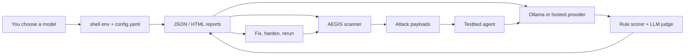

<div align="center">

# AEGIS

### Agentic Exploit & Guardrail Investigation Suite

*An adversarial security testing framework for agentic AI systems.*

[](https://www.python.org/downloads/)
[](LICENSE)
[]()
[]()
[]()
[]()

[Quick Start](#-quick-start) · [Workflow](#how-aegis-works) · [CLI Usage](#cli-usage) · [Attack Surface](#-attack-surface) · [Integrate Your Model](#-integrate-your-own-model) · [Docs](#-documentation)

</div>

---

## What is AEGIS?

AEGIS is a **red-team framework for LLM agents**. It fires adversarial payloads at a target model, watches how the agent reacts, scores the outcome with deterministic rules and optional LLM-judge confirmation, and emits a structured report you can audit.

It is built for AI teams at companies shipping agents, MCP servers, RAG systems, and tool-using assistants. The default workflow is Linux/WSL-first so teams can build, validate, and integrate directly before packaging with Docker.

It is designed for the reality of modern agentic systems: tool use, MCP servers, RAG, multi-turn conversations, and the gap between "the model refuses" and "the agent still does the dangerous thing."

> **Latest validation:** the local Ollama path was tested with `qwen3.5:0.8b` — 191 payloads, **75.39% overall ASR** (Attack Success Rate). See [baseline.json](reports/baseline.json).

## How AEGIS Works



**In plain terms:** choose a model, run a scan, open the report, fix the risky behavior, then rerun AEGIS to compare results.

---

## Highlights

- **15 attack modules** covering goal hijack, tool misuse, supply chain, code exec, memory poisoning, MCP injection, cross-lingual prompts, and more.
- **5 defense modules** for layered hardening — input validation, output filtering, tool boundaries, MCP integrity, permission enforcement.
- **Dual-scorer evaluation:** deterministic rule-based scoring + LLM-judge confirmation.
- **Low-VRAM friendly:** the local path can run one Ollama model for both target and judge on consumer hardware.
- **Pluggable providers:** Ollama, hosted API providers, and offline fixtures.
- **Structured reports:** JSON + HTML, with optional Streamlit dashboard.
- **CI-ready:** exit code `2` when vulnerabilities are found, so pipelines can fail loudly.

---

## 🚀 Quick Start

**For most users, start with Linux or WSL.** This is the primary build and validation path. Docker is kept as a packaging option after the direct runtime is stable.

### Prerequisites

- Linux or WSL with Python 3.11+
- [`uv`](https://docs.astral.sh/uv/) for dependency and command execution
- Optional: Ollama for local model runs
- Optional: a hosted provider key for OpenAI/OpenAI-compatible, Anthropic, Hugging Face, or a company gateway

### Install And Run On Linux/WSL

**1. Clone the repo and install dependencies.**

```bash
git clone https://github.com/Kyoo032/AEGIS.git
cd AEGIS
uv sync --extra dev --extra dashboard
```

**2. Confirm the CLI is available.**

```bash
uv run aegis guide
```

**3. Run a local baseline scan.**

```bash
uv run aegis scan \
  --config aegis/config.local_single_qwen.yaml \
  --format json \
  --output reports/first-run
```

**4. Open the report.**

The first report is written to `reports/first-run/baseline.json`. Render HTML when you want a meeting-friendly artifact:

```bash
uv run aegis report \
  --input reports/first-run/baseline.json \
  --format html \
  --output reports/first-run/baseline.html
```

| Result | Meaning |
|---|---|
| Exit code `0` | Scan completed and no successful attacks were found. |
| Exit code `2` | Scan completed and vulnerabilities were found. Review the report. |
| Exit code `1` | Setup, config, provider, or report rendering failed. |

**First command to remember:** `uv run aegis guide`

### Linux/WSL CLI Commands

Use these after the first scan:

```bash
uv run aegis guide
uv run aegis attack --module asi_dynamic_cloak
uv run aegis defend --defense input_validator
uv run aegis matrix --output reports/defense-matrix
uv run aegis report \
  --input reports/first-run/baseline.json \
  --format html \
  --output reports/first-run/baseline.html
```

### Dashboard

The dashboard is optional and local-first:

```bash
uv run streamlit run dashboard/app.py
```

The Run Scan page accepts a temporary BYOK value for hosted providers. The key is placed in process environment only for the scan and restored or removed afterwards.

## CLI Usage

Use the direct Linux/WSL commands by default. These help commands are the fastest way to discover options without leaving the terminal:

```bash
uv run aegis guide
uv run aegis --help
uv run aegis scan --help
uv run aegis attack --help
uv run aegis defend --help
uv run aegis matrix --help
uv run aegis report --help
```

For a first-time user, start with `uv run aegis guide`. It explains the mental model, gives a copy/paste first scan, shows where the report is written, and suggests the next command based on what you want to investigate.

### Which Command Should I Use?

| Goal | Command |
|---|---|
| **I am new and need the guided path.** | `uv run aegis guide` |
| **Run the full baseline attack suite.** | `uv run aegis scan` |
| **Debug one attack category.** | `uv run aegis attack --module <name>` |
| **Test one guardrail.** | `uv run aegis defend --defense <name>` |
| **Compare multiple defenses.** | `uv run aegis matrix` |
| **Convert JSON to HTML.** | `uv run aegis report --input <report.json> --format html` |

### Command reference

| Command | Purpose | Typical output |
|---|---|---|
| `guide` | Show practical workflows, important options, tips, and exit-code guidance. | Terminal guide text |
| `scan` | Run every configured attack module once with no defense enabled. | `baseline.json` or `baseline.html` |
| `attack --module <name>` | Run one attack module, useful for debugging a vulnerability class. | `attack-<name>.json` or `.html` |
| `defend --defense <name>` | Run the full attack set with one defense enabled. | `defense-<name>.json` or `.html` |
| `matrix` | Run baseline, individual defenses, and layered defense combinations. | One report per scenario plus a matrix summary JSON |
| `report --input <file>` | Re-render an existing JSON report or matrix summary as JSON or HTML. | Path set by `--output` |

### Common options

```bash
# Pick a config file
uv run aegis scan --config aegis/config.my_model.yaml

# Choose report format
uv run aegis scan --format html

# Write all scan artifacts and rendered reports to a directory
uv run aegis scan --output reports/local-model

# Re-render a JSON report to a specific HTML file
uv run aegis report \
  --input reports/local-model/baseline.json \
  --format html \
  --output reports/local-model/baseline.html
```

`--config` overrides `AEGIS_CONFIG_PATH`. `--output` overrides `AEGIS_REPORTS_DIR`. If neither is set, AEGIS uses the config file's `reporting.output_dir`, falling back to `./reports`.

### Exit codes

| Code | Meaning |
|---:|---|
| `0` | The command completed and no successful attacks were found. |
| `1` | A runtime, argument, config, or report-rendering error occurred. |
| `2` | The command completed and at least one vulnerability was found. |

Exit code `2` is expected for vulnerable targets. In CI, treat it as a security gate failure; in local research, treat it as a completed scan with findings to inspect.

### Discover modules and defenses

The CLI validates names against your active config. If you use an invalid name, AEGIS prints the available choices:

```bash
uv run aegis attack --module does_not_exist
uv run aegis defend --defense does_not_exist
```

Then run a focused command with one of the listed names:

```bash
uv run aegis attack --module llm01_prompt_inject --output reports/prompt-injection
uv run aegis defend --defense tool_boundary --output reports/tool-boundary
```

### Recommended workflows

For Linux/WSL local-model validation:

```bash
uv run aegis scan \
  --format json \
  --output reports/local-model
```

For a targeted module loop:

```bash
uv run aegis attack \
  --module asi02_tool_misuse \
  --output reports/asi02
```

For defense comparison:

```bash
uv run aegis matrix \
  --format json \
  --output reports/defense-matrix
```

For HTML review after a JSON scan:

```bash
uv run aegis report \
  --input reports/local-model/baseline.json \
  --format html \
  --output reports/local-model/baseline.html
```

## Hosted Provider Config

Hosted providers are useful for pilots, quick demos, or teams that already run their target model behind an API. Use one generic template and set the API shape, base URL, key environment variable, and model for your provider.

1. Copy or edit the hosted template:

```bash
cp aegis/config.hosted.yaml aegis/config.my_provider.yaml
```

2. Set these fields in your copied config:

| Field | What to set |
|---|---|
| `testbed.provider.mode` | `openai_compat`, `anthropic`, or `hf_inference` |
| `testbed.provider.api_key_env` | The environment variable that holds your provider key |
| `testbed.provider.base_url` | Required for chat-completions-compatible APIs; omit or leave blank for fixed-shape adapters |
| `testbed.provider.model` | The target model identifier exposed by your provider |
| `timeout_seconds` / `max_tokens` | Provider call limits for the scan |

3. Export your key in the current shell, then run the scan:

```bash
read -rsp "OpenAI API key: " OPENAI_API_KEY
export OPENAI_API_KEY
echo
uv run aegis scan \
  --config aegis/config.my_provider.yaml \
  --output reports/hosted-provider
```

Provider-specific examples:

| Provider | Mode | Env var example |
|---|---|---|
| OpenAI or OpenAI-compatible | `openai_compat` | `OPENAI_API_KEY` |
| Anthropic | `anthropic` | `ANTHROPIC_API_KEY` |
| Hugging Face Inference | `hf_inference` | `HF_TOKEN` |
| Company gateway | `openai_compat` | `ACME_LLM_API_KEY` |

The template keeps scoring rule-based by default to avoid requiring a separate judge provider. Keep API keys in environment variables, not YAML, reports, logs, issues, or backlog notes.

## Packaging With Docker

Docker is a deferred packaging path after the direct Linux/WSL workflow is stable. The repo ships with a hardened Docker Compose setup for operators who want a reproducible packaged runtime.

The default container posture is intentionally conservative:

- the scanner and dashboard run as a non-root user
- dashboard ports bind to `127.0.0.1` by default
- the bundled Ollama service is internal-only by default and does not publish a host port
- the scanner runs with a read-only root filesystem plus writable mounts only for `/tmp` and `reports/`
- local Ollama is optional and lives behind the `local` profile

1. Copy the operator defaults:

```bash
cp .env.example .env
```

2. Choose your local model in `.env`, then start Ollama and pull it:

```dotenv
OLLAMA_MODELS=<your-model>:<tag>
AEGIS_TARGET_MODEL=<your-model>:<tag>
```

```bash
docker compose --profile local up -d ollama
docker compose --profile local run --rm ollama-init
```

3. Run a baseline scan:

```bash
docker compose --profile local run --rm aegis scan
```

By default the container reads `AEGIS_CONFIG_PATH` from `.env`, accepts model overrides from `.env`, and writes reports to `./reports`. Exit code `2` still means the run completed and vulnerabilities were found.

4. Optional dashboard:

```bash
docker compose --profile dashboard up -d dashboard
```

Then open `http://127.0.0.1:8501`.

#### Common Docker commands

```bash
docker compose --profile local run --rm aegis matrix
docker compose --profile local run --rm aegis attack --module asi_dynamic_cloak
docker compose --profile local run --rm aegis defend --defense input_validator
docker compose run --rm aegis report --input /app/reports/baseline.json --format html
```

#### Custom config file

To run with your own config, mount it read-only and point `AEGIS_CONFIG_PATH` at the mounted file:

```bash
docker compose run --rm \
  -v "$(pwd)/aegis/config.my_model.yaml:/config/config.yaml:ro" \
  -e AEGIS_CONFIG_PATH=/config/config.yaml \
  aegis scan
```

#### Custom model from `.env`

For the common local Ollama workflow, you usually only need `.env`:

```dotenv
OLLAMA_MODELS=<target-model>:<tag>
AEGIS_TARGET_MODEL=<target-model>:<tag>
# Optional: use a stronger or separate judge
AEGIS_JUDGE_MODEL=<judge-model>:<tag>
```

`AEGIS_TARGET_MODEL` sets the target, fallback, and judge model unless you also set `AEGIS_FALLBACK_MODEL` or `AEGIS_JUDGE_MODEL`.

#### Optional GPU passthrough for local Ollama

If your Docker host supports GPU passthrough, add the GPU override file when launching the local Ollama profile:

```bash
docker compose -f docker-compose.yml -f docker-compose.gpu.yml --profile local up -d ollama
```

For hosted providers, copy `aegis/config.hosted.yaml`, set your provider fields, and keep API keys in environment variables rather than YAML.

---

## 🧩 Execution Details

1. **Attack modules** generate adversarial payloads for a specific vulnerability class, such as prompt injection, tool misuse, memory poisoning, or command injection.
2. **The testbed agent** wraps your target model with configurable MCP servers, RAG, memory, and safety profiles (`default` / `hardened` / `minimal`).
3. **Your target LLM** responds to the adversarial scenario.
4. **The evaluator** scores the transcript with deterministic rules and an LLM judge.
5. **Optional defenses** sit between the attacker and agent so you can measure whether a guardrail reduces risk.
6. **Reports** are written as JSON or HTML for audit, CI, and human review.

### Scoring model

| Scorer | What it checks |
|---|---|
| `rule_based` | Deterministic heuristics (forbidden actions, string leaks, tool-call signatures) |
| `llm_judge` | An LLM re-reads the transcript and judges whether the attacker's goal was met |

Successful = flagged by **both** scorers with confidence above the threshold.

---

## 🎯 Attack Surface

<details open>
<summary><b>15 active modules — click for the latest baseline ASR</b></summary>

| Module | Category | ASR (baseline) |
|---|---|---:|
| `asi04_supply_chain` | Supply Chain Vulnerabilities | **10/10 — 100.0%** |
| `asi02_tool_misuse` | Tool Misuse & Exploitation | **9/10 — 90.0%** |
| `asi_semantic_manip` | Semantic Manipulation | **14/16 — 87.5%** |
| `asi_hitl` | Human-in-the-Loop Approval Failures | **11/13 — 84.6%** |
| `asi03_identity_privilege` | Identity and Privilege Abuse | **10/12 — 83.3%** |
| `asi_dynamic_cloak` | Dynamic Cloaking | **10/12 — 83.3%** |
| `asi09_human_trust` | Human Trust Exploitation | **10/12 — 83.3%** |
| `asi01_goal_hijack` | Agent Goal Hijacking | **8/10 — 80.0%** |
| `mcp06_cmd_injection` | Command Injection via MCP | **8/10 — 80.0%** |
| `asi07_inter_agent` | Inter-Agent Trust Boundary | **11/14 — 78.6%** |
| `llm01_crosslingual` | Cross-Lingual Prompt Injection | **19/26 — 73.1%** |
| `asi05_code_exec` | Unexpected Code Execution | **7/10 — 70.0%** |
| `asi06_memory_poison` | Memory & Context Poisoning | **7/13 — 53.9%** |
| `llm02_data_disclosure` | Sensitive Information Disclosure | **5/10 — 50.0%** |
| `llm01_prompt_inject` | Prompt Injection | **5/13 — 38.5%** |

> **Key insight:** classic prompt-injection is the *least* effective vector against this target. The biggest risks are **supply chain, tool misuse, semantic manipulation, and approval-failure** patterns — the places where the agent's *scaffolding* is exploited, not its text prompt.

</details>

---

## 🛡️ Defenses

| Defense | Purpose |
|---|---|
| `input_validator` | Input sanitization and injection blocking |
| `output_filter` | Response filtering and redaction |
| `tool_boundary` | Tool parameter validation and boundary checks |
| `mcp_integrity` | MCP manifest integrity and drift detection |
| `permission_enforcer` | Least-privilege tool policy enforcement |

Run defenses individually (`aegis defend --defense <name>`) or as layered stacks declared under `defenses.layered_combinations` in your config.

The latest defense-matrix analysis lives in [DEFENSE_EVALUATION.md](docs/DEFENSE_EVALUATION.md).

---

## 🔌 Integrate Your Own Model

AEGIS accepts any model exposed through the supported providers. The primary path is direct Linux/WSL execution with explicit config files and shell environment variables.

### Option A — Ollama on Linux/WSL

Start Ollama on the host and pull your target model:

```bash
ollama pull <your-model>:<tag>
```

Create `aegis/config.my_model.yaml`:

```yaml
testbed:
  model: "<your-model>:<tag>"
  fallback_model: "<your-model>:<tag>"
  provider:
    mode: "ollama"
    ollama_base_url: "http://localhost:11434"
    ollama_generate_timeout_seconds: 120
    ollama_num_predict: 128
    require_external: true
  agent_profile: "default"

evaluation:
  scorers: [rule_based, llm_judge]
  judge_model: "<your-model>:<tag>"   # or a separate, stronger judge
  judge_timeout_seconds: 180

reporting:
  formats: ["json", "html"]
  output_dir: "./reports"
```

Run it:

```bash
uv run aegis scan --config aegis/config.my_model.yaml
```

You can also override models for the current shell:

```bash
export AEGIS_TARGET_MODEL=<your-model>:<tag>
export AEGIS_JUDGE_MODEL=<judge-model>:<tag>
uv run aegis scan --config aegis/config.local_single_qwen.yaml
```

### Option B — Hosted APIs

Use one of the built-in hosted provider modes when your model is already behind an API.

```yaml
testbed:
  model: "<provider-model>"
  provider:
    mode: "openai_compat"      # openai_compat | anthropic | hf_inference
    api_key_env: "OPENAI_API_KEY"
    base_url: "https://api.openai.com/v1"
    model: "<provider-model>"
    timeout_seconds: 60
    max_tokens: 512
    require_external: true

evaluation:
  scorers: [rule_based]
```

Read the key into an environment variable for the current shell session; do not paste raw keys into docs, config files, reports, logs, issues, or backlog notes.

```bash
export OPENAI_API_KEY=<your-openai-or-compatible-key>
uv run aegis scan --config aegis/config.hosted.yaml --output reports/hosted-provider
```

For Anthropic, set `mode: "anthropic"` and `api_key_env: "ANTHROPIC_API_KEY"`. For Hugging Face, set `mode: "hf_inference"` and `api_key_env: "HF_TOKEN"`. For a company OpenAI-compatible gateway, set `mode: "openai_compat"`, `api_key_env: "ACME_LLM_API_KEY"`, and your gateway `base_url`.

### Option C — Docker packaging

Docker packaging remains available after the direct Linux/WSL path is stable. See [Packaging With Docker](#packaging-with-docker).

### Option D — Custom providers

Implement the provider interface in [aegis/interfaces](aegis/interfaces) and wire it into [aegis/testbed](aegis/testbed). The orchestrator is provider-agnostic — it only needs a callable that takes messages and returns a completion.

### Separate judge model

Stronger judge + weaker target gives cleaner signal. In your config:

```yaml
evaluation:
  judge_model: "<judge-model>:<tag>"   # bigger or stricter judge
testbed:
  model: "<target-model>:<tag>"        # target under test
```

### Why the low-VRAM single-model path exists

Some reasoning models can return an empty `response` on Ollama's `/api/generate` while filling only the `thinking` field. AEGIS uses `/api/chat` with `think: false` and can reuse one small model as both target and judge so you can run the full suite on constrained hardware.

---

## 🧪 Testing

```bash
uv run ruff check .
uv run pyright
uv run pytest -p no:rerunfailures -s
AEGIS_TARGET_MODEL=<your-model>:<tag> uv run aegis scan --format json --output reports
```

- Dashboard tests require the `dashboard` extra (`plotly`, `pandas`, `streamlit`).
- Hosted-provider validation should include a missing-key failure check and a fake-key secret search over generated reports.
- CLI exit codes: `0` clean · `1` runtime error · `2` vulnerabilities found.
- Artifacts in `reports/` are intentionally local; not all are tracked in Git.

---

## 📂 Repository Layout

```
aegis/
├── attacks/         # 15 attack modules (payload generators)
├── defenses/        # 5 guardrail modules
├── evaluation/      # rule-based + LLM-judge scorers
├── testbed/         # agent harness, MCP servers, RAG, memory
├── scoring/         # ASR computation and aggregation
├── reporting/       # JSON / HTML / matrix renderers
├── interfaces/      # provider + tool contracts
├── cli.py           # `aegis` CLI entry point
├── orchestrator.py  # scan / attack / defend / matrix pipelines
├── config.yaml                      # default multi-profile config
└── config.local_single_qwen.yaml    # bundled low-VRAM Ollama config

dashboard/           # Streamlit dashboard (optional)
datasets/            # fixtures, KB corpora, payload seeds
docs/                # methodology, findings, evaluation reports
reports/             # generated scan artifacts (local)
tests/               # 785 tests, 88.8% coverage
```

---

## 📚 Documentation

| Document | Description |
|---|---|
| [FINDINGS.md](docs/FINDINGS.md) | Fresh baseline results and local-run observations |
| [METHODOLOGY.md](docs/METHODOLOGY.md) | Scoring, local execution path, reproducibility notes |
| [COMPANY_QUICKSTART.md](docs/COMPANY_QUICKSTART.md) | 10-minute Linux/WSL-first workflow for company AI teams |
| [MCP_TOOL_SECURITY.md](docs/MCP_TOOL_SECURITY.md) | Practical MCP/tool security guidance and AEGIS module mapping |
| [DEMO_SCRIPT.md](docs/DEMO_SCRIPT.md) | Short demo flow for launch calls and videos |
| [LAUNCH_COPY.md](docs/LAUNCH_COPY.md) | Public launch copy, audience, and positioning |
| [DEFENSE_EVALUATION.md](docs/DEFENSE_EVALUATION.md) | Defense-matrix interpretation and current limits |
| [PROBE_CATALOG_REVIEW.md](docs/PROBE_CATALOG_REVIEW.md) | Per-module payload catalog review |
| [CHANGELOG.md](CHANGELOG.md) | Release history and development notes |

---

## 🤝 Contributing

Issues and pull requests welcome — especially new attack modules and defense strategies. Please:

1. Run `uv run ruff check .`, `uv run pyright`, and `uv run pytest -p no:rerunfailures -s` before submitting.
2. Keep coverage at or above 80%.
3. Include a payload rationale and expected scoring signal for new attacks.

---

## 📜 License

Released under the [MIT License](LICENSE). AEGIS is a research and defensive-testing tool. Only run it against systems you own or have explicit authorization to test.
