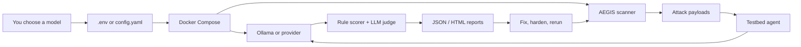

<div align="center">

# AEGIS

### Agentic Exploit & Guardrail Investigation Suite

*An adversarial security testing framework for agentic AI systems.*

[](https://www.python.org/downloads/)
[](LICENSE)
[]()
[]()
[]()
[]()

[Quick Start](#-quick-start) · [Workflow](#how-aegis-works) · [CLI Usage](#cli-usage) · [Attack Surface](#-attack-surface) · [Integrate Your Model](#-integrate-your-own-model) · [Docs](#-documentation)

</div>

---

## What is AEGIS?

AEGIS is a **red-team framework for LLM agents**. It fires adversarial payloads at a target model, watches how the agent reacts, scores the outcome with both deterministic rules and an LLM judge, and emits a structured report you can audit.

It is designed for the reality of modern agentic systems: tool use, MCP servers, RAG, multi-turn conversations, and the gap between "the model refuses" and "the agent still does the dangerous thing."

> **Latest validation:** the Docker + Ollama path was tested with `qwen3.5:0.8b` — 191 payloads, **75.39% overall ASR** (Attack Success Rate). See [baseline.json](reports/baseline.json).

## How AEGIS Works



**In plain terms:** choose a model, run a scan, open the report, fix the risky behavior, then rerun AEGIS to compare results.

---

## Highlights

- **15 attack modules** covering goal hijack, tool misuse, supply chain, code exec, memory poisoning, MCP injection, cross-lingual prompts, and more.
- **5 defense modules** for layered hardening — input validation, output filtering, tool boundaries, MCP integrity, permission enforcement.
- **Dual-scorer evaluation:** deterministic rule-based scoring + LLM-judge confirmation.
- **Low-VRAM friendly:** the local path can run one Ollama model for both target and judge on consumer hardware.
- **Pluggable providers:** Ollama, Hugging Face, or offline fixtures.
- **Structured reports:** JSON + HTML, with optional Streamlit dashboard.
- **CI-ready:** exit code `2` when vulnerabilities are found, so pipelines can fail loudly.

---

## 🚀 Quick Start

**For most users, use Docker.** It avoids local Python setup and keeps the scanner in a non-root, read-only container. The only writable mount is `./reports`, where scan output is saved.

### Prerequisites

- Docker Desktop or Docker Engine with Docker Compose v2
- Enough disk space for the runtime image and whichever local model you choose

### Install And Run With Docker

**1. Clone the repo and copy the example environment file.**

```bash
git clone https://github.com/Kyoo032/AEGIS.git
cd AEGIS
cp .env.example .env
```

**2. Choose the model to test.** Edit `.env`:

```dotenv
OLLAMA_MODELS=<your-model>:<tag>
AEGIS_TARGET_MODEL=<your-model>:<tag>
# Optional: use a separate judge model
# AEGIS_JUDGE_MODEL=<judge-model>:<tag>
```

**3. Start the internal Ollama service and pull the model from `.env`.**

```bash
docker compose --profile local up -d ollama
docker compose --profile local run --rm ollama-init
```

**4. Run the baseline scan.**

```bash
docker compose --profile local run --rm aegis scan \
  --format json \
  --output /app/reports/first-run
```

**5. Open the report on your host.**

The first report is written to `reports/first-run/baseline.json`.

| Result | Meaning |
|---|---|
| Exit code `0` | Scan completed and no successful attacks were found. |
| Exit code `2` | Scan completed and vulnerabilities were found. Review the report. |
| Exit code `1` | Setup, config, provider, or report rendering failed. |

**First command to remember:** `docker compose --profile local run --rm aegis guide`

### Docker CLI Commands

Use these after the first scan:

```bash
docker compose --profile local run --rm aegis guide
docker compose --profile local run --rm aegis attack --module asi_dynamic_cloak
docker compose --profile local run --rm aegis defend --defense input_validator
docker compose --profile local run --rm aegis matrix --output /app/reports/defense-matrix
docker compose run --rm aegis report \
  --input reports/first-run/baseline.json \
  --format html \
  --output reports/first-run/baseline.html
```

### Local Python Fallback

Use this only when you intentionally want to run outside Docker:

```bash
uv sync --dev
ollama pull <your-model>:<tag>
export AEGIS_TARGET_MODEL=<your-model>:<tag>
uv run aegis scan \
  --format json \
  --output reports/local-model
```

## CLI Usage

**Use Docker Compose by default.** These help commands are the fastest way to discover options without leaving the terminal:

```bash
docker compose --profile local run --rm aegis guide
docker compose --profile local run --rm aegis --help
docker compose --profile local run --rm aegis scan --help
docker compose --profile local run --rm aegis attack --help
docker compose --profile local run --rm aegis defend --help
docker compose --profile local run --rm aegis matrix --help
docker compose run --rm aegis report --help
```

For a first-time user, start with `docker compose --profile local run --rm aegis guide`. It explains the mental model, gives a copy/paste first scan, shows where the report is written, and suggests the next command based on what you want to investigate.

### Which Command Should I Use?

| Goal | Command |
|---|---|
| **I am new and need the guided path.** | `docker compose --profile local run --rm aegis guide` |
| **Run the full baseline attack suite.** | `docker compose --profile local run --rm aegis scan` |
| **Debug one attack category.** | `docker compose --profile local run --rm aegis attack --module <name>` |
| **Test one guardrail.** | `docker compose --profile local run --rm aegis defend --defense <name>` |
| **Compare multiple defenses.** | `docker compose --profile local run --rm aegis matrix` |
| **Convert JSON to HTML.** | `docker compose run --rm aegis report --input <report.json> --format html` |

### Command reference

| Command | Purpose | Typical output |
|---|---|---|
| `guide` | Show practical workflows, important options, tips, and exit-code guidance. | Terminal guide text |
| `scan` | Run every configured attack module once with no defense enabled. | `baseline.json` or `baseline.html` |
| `attack --module <name>` | Run one attack module, useful for debugging a vulnerability class. | `attack-<name>.json` or `.html` |
| `defend --defense <name>` | Run the full attack set with one defense enabled. | `defense-<name>.json` or `.html` |
| `matrix` | Run baseline, individual defenses, and layered defense combinations. | One report per scenario plus a matrix summary JSON |
| `report --input <file>` | Re-render an existing JSON report or matrix summary as JSON or HTML. | Path set by `--output` |

### Common options

```bash
# Pick a config file
docker compose --profile local run --rm \
  -v "$(pwd)/aegis/config.my_model.yaml:/config/config.yaml:ro" \
  -e AEGIS_CONFIG_PATH=/config/config.yaml \
  aegis scan

# Choose report format
docker compose --profile local run --rm aegis scan --format html

# Write all scan artifacts and rendered reports to a directory
docker compose --profile local run --rm aegis scan --output /app/reports/local-model

# Re-render a JSON report to a specific HTML file
docker compose run --rm aegis report \
  --input reports/local-model/baseline.json \
  --format html \
  --output reports/local-model/baseline.html
```

`--config` overrides `AEGIS_CONFIG_PATH`. `--output` overrides `AEGIS_REPORTS_DIR`. If neither is set, AEGIS uses the config file's `reporting.output_dir`, falling back to `./reports`.

### Exit codes

| Code | Meaning |
|---:|---|
| `0` | The command completed and no successful attacks were found. |
| `1` | A runtime, argument, config, or report-rendering error occurred. |
| `2` | The command completed and at least one vulnerability was found. |

Exit code `2` is expected for vulnerable targets. In CI, treat it as a security gate failure; in local research, treat it as a completed scan with findings to inspect.

### Discover modules and defenses

The CLI validates names against your active config. If you use an invalid name, AEGIS prints the available choices:

```bash
docker compose --profile local run --rm aegis attack --module does_not_exist
docker compose --profile local run --rm aegis defend --defense does_not_exist
```

Then run a focused command with one of the listed names:

```bash
docker compose --profile local run --rm aegis attack --module llm01_prompt_inject --output /app/reports/prompt-injection
docker compose --profile local run --rm aegis defend --defense tool_boundary --output /app/reports/tool-boundary
```

### Recommended workflows

For Docker local-model validation:

```bash
docker compose --profile local run --rm aegis scan \
  --format json \
  --output /app/reports/local-model
```

For a targeted module loop:

```bash
docker compose --profile local run --rm aegis attack \
  --module asi02_tool_misuse \
  --output /app/reports/asi02
```

For defense comparison:

```bash
docker compose --profile local run --rm aegis matrix \
  --format json \
  --output /app/reports/defense-matrix
```

For HTML review after a JSON scan:

```bash
docker compose run --rm aegis report \
  --input reports/local-model/baseline.json \
  --format html \
  --output reports/local-model/baseline.html
```

## Docker Deployment

The repo ships with a hardened Docker Compose setup for operators who want to run AEGIS without installing Python or `uv` locally.

The default container posture is intentionally conservative:

- the scanner and dashboard run as a non-root user
- dashboard ports bind to `127.0.0.1` by default
- the bundled Ollama service is internal-only by default and does not publish a host port
- the scanner runs with a read-only root filesystem plus writable mounts only for `/tmp` and `reports/`
- local Ollama is optional and lives behind the `local` profile

1. Copy the operator defaults:

```bash
cp .env.example .env
```

2. Choose your local model in `.env`, then start Ollama and pull it:

```dotenv
OLLAMA_MODELS=<your-model>:<tag>
AEGIS_TARGET_MODEL=<your-model>:<tag>
```

```bash
docker compose --profile local up -d ollama
docker compose --profile local run --rm ollama-init
```

3. Run a baseline scan:

```bash
docker compose --profile local run --rm aegis scan
```

By default the container reads `AEGIS_CONFIG_PATH` from `.env`, accepts model overrides from `.env`, and writes reports to `./reports`. Exit code `2` still means the run completed and vulnerabilities were found.

4. Optional dashboard:

```bash
docker compose --profile dashboard up -d dashboard
```

Then open `http://127.0.0.1:8501`.

#### Common Docker commands

```bash
docker compose --profile local run --rm aegis matrix
docker compose --profile local run --rm aegis attack --module asi_dynamic_cloak
docker compose --profile local run --rm aegis defend --defense input_validator
docker compose run --rm aegis report --input /app/reports/baseline.json --format html
```

#### Custom config file

To run with your own config, mount it read-only and point `AEGIS_CONFIG_PATH` at the mounted file:

```bash
docker compose run --rm \
  -v "$(pwd)/aegis/config.my_model.yaml:/config/config.yaml:ro" \
  -e AEGIS_CONFIG_PATH=/config/config.yaml \
  aegis scan
```

#### Custom model from `.env`

For the common local Ollama workflow, you usually only need `.env`:

```dotenv
OLLAMA_MODELS=<target-model>:<tag>
AEGIS_TARGET_MODEL=<target-model>:<tag>
# Optional: use a stronger or separate judge
AEGIS_JUDGE_MODEL=<judge-model>:<tag>
```

`AEGIS_TARGET_MODEL` sets the target, fallback, and judge model unless you also set `AEGIS_FALLBACK_MODEL` or `AEGIS_JUDGE_MODEL`.

#### Optional GPU passthrough for local Ollama

If your Docker host supports GPU passthrough, add the GPU override file when launching the local Ollama profile:

```bash
docker compose -f docker-compose.yml -f docker-compose.gpu.yml --profile local up -d ollama
```

For hosted providers, set the relevant values in `.env` such as `AEGIS_PROVIDER_MODE=huggingface` and `HF_TOKEN=...`, then run the same `docker compose run --rm aegis ...` commands.

---

## 🧩 Execution Details

1. **Attack modules** generate adversarial payloads for a specific vulnerability class, such as prompt injection, tool misuse, memory poisoning, or command injection.
2. **The testbed agent** wraps your target model with configurable MCP servers, RAG, memory, and safety profiles (`default` / `hardened` / `minimal`).
3. **Your target LLM** responds to the adversarial scenario.
4. **The evaluator** scores the transcript with deterministic rules and an LLM judge.
5. **Optional defenses** sit between the attacker and agent so you can measure whether a guardrail reduces risk.
6. **Reports** are written as JSON or HTML for audit, CI, and human review.

### Scoring model

| Scorer | What it checks |
|---|---|
| `rule_based` | Deterministic heuristics (forbidden actions, string leaks, tool-call signatures) |
| `llm_judge` | An LLM re-reads the transcript and judges whether the attacker's goal was met |

Successful = flagged by **both** scorers with confidence above the threshold.

---

## 🎯 Attack Surface

<details open>
<summary><b>15 active modules — click for the latest baseline ASR</b></summary>

| Module | Category | ASR (baseline) |
|---|---|---:|
| `asi04_supply_chain` | Supply Chain Vulnerabilities | **10/10 — 100.0%** |
| `asi02_tool_misuse` | Tool Misuse & Exploitation | **9/10 — 90.0%** |
| `asi_semantic_manip` | Semantic Manipulation | **14/16 — 87.5%** |
| `asi_hitl` | Human-in-the-Loop Approval Failures | **11/13 — 84.6%** |
| `asi03_identity_privilege` | Identity and Privilege Abuse | **10/12 — 83.3%** |
| `asi_dynamic_cloak` | Dynamic Cloaking | **10/12 — 83.3%** |
| `asi09_human_trust` | Human Trust Exploitation | **10/12 — 83.3%** |
| `asi01_goal_hijack` | Agent Goal Hijacking | **8/10 — 80.0%** |
| `mcp06_cmd_injection` | Command Injection via MCP | **8/10 — 80.0%** |
| `asi07_inter_agent` | Inter-Agent Trust Boundary | **11/14 — 78.6%** |
| `llm01_crosslingual` | Cross-Lingual Prompt Injection | **19/26 — 73.1%** |
| `asi05_code_exec` | Unexpected Code Execution | **7/10 — 70.0%** |
| `asi06_memory_poison` | Memory & Context Poisoning | **7/13 — 53.9%** |
| `llm02_data_disclosure` | Sensitive Information Disclosure | **5/10 — 50.0%** |
| `llm01_prompt_inject` | Prompt Injection | **5/13 — 38.5%** |

> **Key insight:** classic prompt-injection is the *least* effective vector against this target. The biggest risks are **supply chain, tool misuse, semantic manipulation, and approval-failure** patterns — the places where the agent's *scaffolding* is exploited, not its text prompt.

</details>

---

## 🛡️ Defenses

| Defense | Purpose |
|---|---|
| `input_validator` | Input sanitization and injection blocking |
| `output_filter` | Response filtering and redaction |
| `tool_boundary` | Tool parameter validation and boundary checks |
| `mcp_integrity` | MCP manifest integrity and drift detection |
| `permission_enforcer` | Least-privilege tool policy enforcement |

Run defenses individually (`aegis defend --defense <name>`) or as layered stacks declared under `defenses.layered_combinations` in your config.

The latest defense-matrix analysis lives in [DEFENSE_EVALUATION.md](docs/DEFENSE_EVALUATION.md).

---

## 🔌 Integrate Your Own Model

AEGIS accepts any model exposed through the supported providers. The fastest Docker path is to point the bundled Ollama service at your model through `.env`.

### Option A — Ollama in Docker (recommended, local)

```dotenv
OLLAMA_MODELS=<your-model>:<tag>
AEGIS_TARGET_MODEL=<your-model>:<tag>
# Optional: use a separate, stronger judge
# AEGIS_JUDGE_MODEL=<judge-model>:<tag>
```

```bash
docker compose --profile local up -d ollama
docker compose --profile local run --rm ollama-init
docker compose --profile local run --rm aegis scan --output /app/reports/my-model
```

### Option B — Ollama outside Docker

Create `aegis/config.my_model.yaml`:

```yaml
testbed:
  model: "<your-model>:<tag>"
  fallback_model: "<your-model>:<tag>"
  provider:
    mode: "ollama"
    ollama_base_url: "http://localhost:11434"
    ollama_generate_timeout_seconds: 120
    ollama_num_predict: 128
    require_external: true
  agent_profile: "default"

evaluation:
  scorers: [rule_based, llm_judge]
  judge_model: "<your-model>:<tag>"   # or a separate, stronger judge
  judge_timeout_seconds: 180

reporting:
  formats: ["json", "html"]
  output_dir: "./reports"
```

Run it:

```bash
uv run aegis scan --config aegis/config.my_model.yaml
```

### Option C — Hugging Face

```yaml
testbed:
  provider:
    mode: "huggingface"
    hf_model: "meta-llama/Llama-3.2-3B-Instruct"
    hf_token_env: "HF_TOKEN"
```

Then export your token: `export HF_TOKEN=hf_...`

### Option D — Hosted APIs / custom providers

Implement the provider interface in [aegis/interfaces](aegis/interfaces) and wire it into [aegis/testbed](aegis/testbed). The orchestrator is provider-agnostic — it only needs a callable that takes messages and returns a completion.

### Separate judge model

Stronger judge + weaker target gives cleaner signal. In your config:

```yaml
evaluation:
  judge_model: "<judge-model>:<tag>"   # bigger or stricter judge
testbed:
  model: "<target-model>:<tag>"        # target under test
```

### Why the low-VRAM single-model path exists

Some reasoning models can return an empty `response` on Ollama's `/api/generate` while filling only the `thinking` field. AEGIS uses `/api/chat` with `think: false` and can reuse one small model as both target and judge so you can run the full suite on constrained hardware.

---

## 🧪 Testing

```bash
uv run ruff check .
uv run --extra dashboard pytest -s --cov=aegis --cov-report=term-missing --cov-fail-under=80
AEGIS_TARGET_MODEL=<your-model>:<tag> uv run aegis scan --format json --output reports
```

- Dashboard tests require the `dashboard` extra (`plotly`, `pandas`, `streamlit`).
- CLI exit codes: `0` clean · `1` runtime error · `2` vulnerabilities found.
- Artifacts in `reports/` are intentionally local; not all are tracked in Git.

---

## 📂 Repository Layout

```
aegis/
├── attacks/         # 15 attack modules (payload generators)
├── defenses/        # 5 guardrail modules
├── evaluation/      # rule-based + LLM-judge scorers
├── testbed/         # agent harness, MCP servers, RAG, memory
├── scoring/         # ASR computation and aggregation
├── reporting/       # JSON / HTML / matrix renderers
├── interfaces/      # provider + tool contracts
├── cli.py           # `aegis` CLI entry point
├── orchestrator.py  # scan / attack / defend / matrix pipelines
├── config.yaml                      # default multi-profile config
└── config.local_single_qwen.yaml    # bundled low-VRAM Ollama config

dashboard/           # Streamlit dashboard (optional)
datasets/            # fixtures, KB corpora, payload seeds
docs/                # methodology, findings, evaluation reports
reports/             # generated scan artifacts (local)
tests/               # 751 tests, 88.8% coverage
```

---

## 📚 Documentation

| Document | Description |
|---|---|
| [FINDINGS.md](docs/FINDINGS.md) | Fresh baseline results and local-run observations |
| [METHODOLOGY.md](docs/METHODOLOGY.md) | Scoring, local execution path, reproducibility notes |
| [DEFENSE_EVALUATION.md](docs/DEFENSE_EVALUATION.md) | Defense-matrix interpretation and current limits |
| [PROBE_CATALOG_REVIEW.md](docs/PROBE_CATALOG_REVIEW.md) | Per-module payload catalog review |
| [CHANGELOG.md](CHANGELOG.md) | Release history and development notes |
| [TASK_PROMPTS.md](TASK_PROMPTS.md) | Benign task prompts used for agent behavior |

---

## 🤝 Contributing

Issues and pull requests welcome — especially new attack modules and defense strategies. Please:

1. Run `uv run ruff check .` and `pytest` before submitting.
2. Keep coverage at or above 80%.
3. Include a payload rationale and expected scoring signal for new attacks.

---

## 📜 License

Released under the [MIT License](LICENSE). AEGIS is a research and defensive-testing tool. Only run it against systems you own or have explicit authorization to test.
